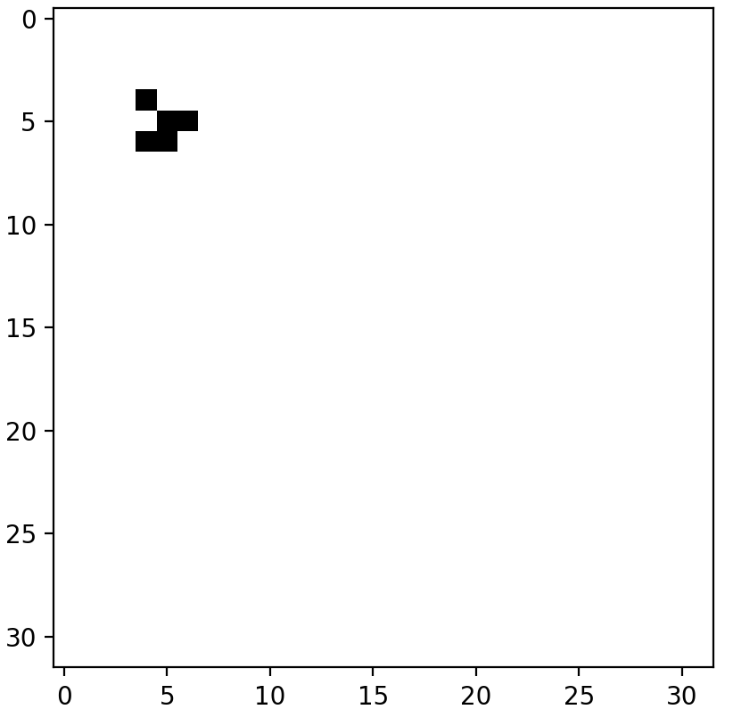
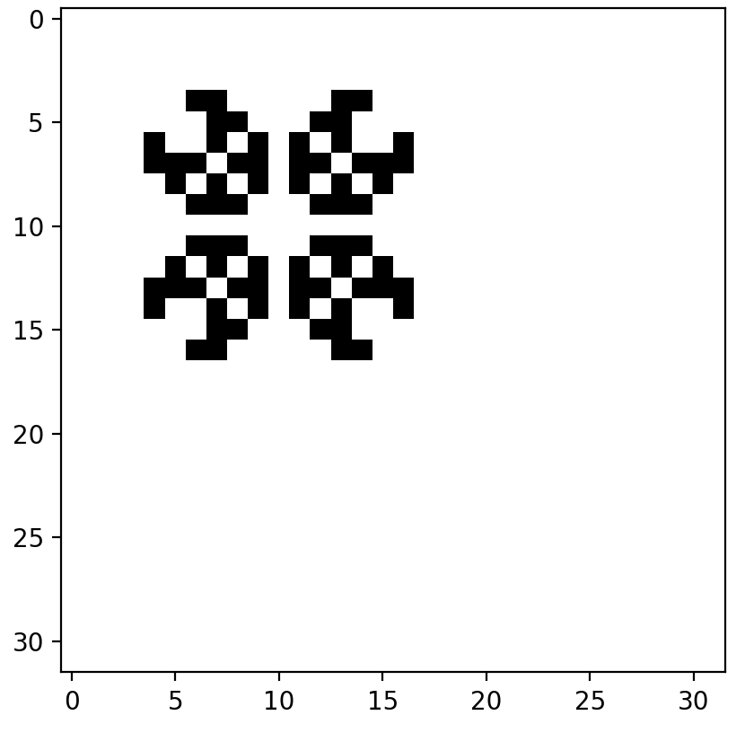
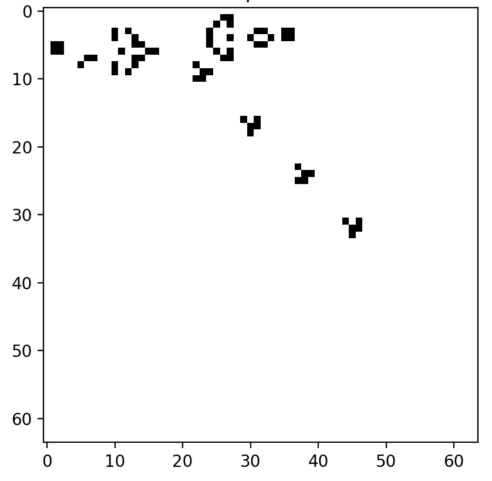

# conway-game-of-life-unit

このGitHubプロジェクトは、Pythonを使用してコンウェイのライフゲームをシミュレートします。  
メインスクリプトでは、事前定義された形状またはランダムな初期状態でシミュレーションを実行できます。以下は開始するための手順です。

左からグライダー,　パルサー,　グライダー銃  





## インストール

1. リポジトリをクローンします:

```sh
git clone https://github.com/yourusername/lifegame-simulation.git
cd lifegame-simulation
```

2. 仮想環境を作成して有効化します:

3. 必要な依存関係をインストールします:

```sh
pip install -r requirements.txt
```

## 使い方

メインスクリプト `main.py` を使用して、さまざまな初期形状やランダムな設定でシミュレーションを実行できます。

### 事前定義された形状でシミュレーションを実行

事前定義された形状でシミュレーションを実行するには:

```sh
python main.py
```

グリッドサイズと形状番号の入力を求められます。使用可能な形状と対応する番号は以下の通りです:

1. グライダー
2. ブロック
3. ビーハイブ
4. ローフ
5. ボート
6. ブリンカー
7. トード
8. パルサー
9. ゴスパーグライダーガン

### ランダムな初期状態でシミュレーションを実行

ランダムな初期状態でシミュレーションを実行するには、`main.py` の `main()` 関数内の `run_random(grid_size)` 行のコメントを解除します:

```python
def main():
    grid_size = int(input("Enter grid size: "))

    # キャラクターを表示させる場合
    #shape_number = int(input("Enter shape number (1: Glider, 2: Block, 3: Beehive, 4: Loaf, 5: Boat, 6: Blinker, 7: Toad, 8: Pulsar, 9: Gosper Glider Gun): "))
    #run_with_shape(shape_number, grid_size)

    # ランダムで行う場合
    run_random(grid_size)
```

その後、スクリプトを実行します:

```sh
python main.py
```

## ライセンス

このプロジェクトはMITライセンスの下でライセンスされています。詳細は [LICENSE](LICENSE) ファイルをご覧ください。

## 貢献

貢献は歓迎します！改善点やバグ修正があれば、イシューを立てるかプルリクエストを提出してください。